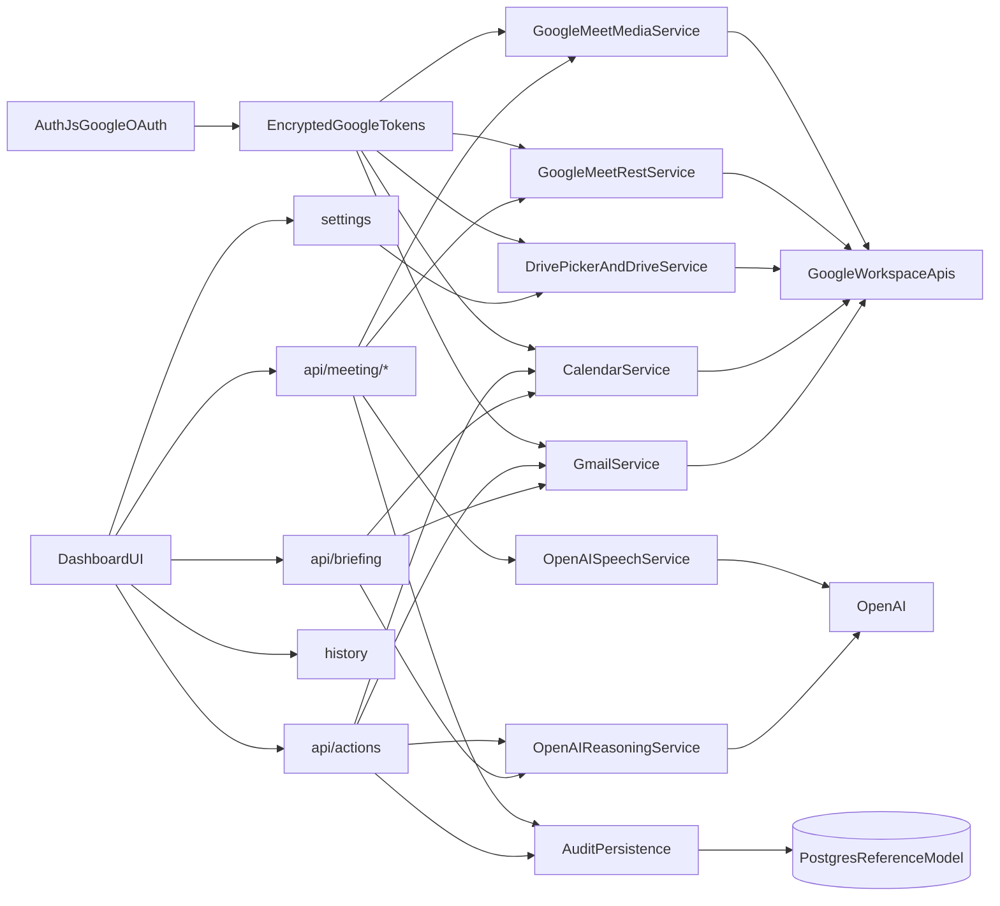

# Relay Google-First Revised Plan

## Planning Inputs

This replan is based on the current checked-in source plus the latest planning history in [AGENTS.md](AGENTS.md), [.cursor/plans/relay_phase_a_plan_fac999d9.plan.md](.cursor/plans/relay_phase_a_plan_fac999d9.plan.md), [.cursor/plans/relay_teams_replan_27c3240f.plan.md](.cursor/plans/relay_teams_replan_27c3240f.plan.md), and [.cursor/plans/relay_hackathon_technical_plan_07cef635.plan.md](.cursor/plans/relay_hackathon_technical_plan_07cef635.plan.md).

Source-of-truth priority for the next implementation passes:

- [AGENTS.md](AGENTS.md): Google-first override, no Teams, no fake success.
- Current shipped UI contracts in [app/(dashboard)/briefing/page.tsx](app/(dashboard)/briefing/page.tsx), [app/(dashboard)/actions/page.tsx](app/(dashboard)/actions/page.tsx), [app/api/briefing/route.ts](app/api/briefing/route.ts), and [app/api/actions/route.ts](app/api/actions/route.ts).
- The current Meeting page and `/api/meeting/*` routes stay as the public surface, but their Teams-specific internals are replaced.

## What Stays

Keep these surfaces and reuse them unless live integration forces a targeted change:

- [app/(dashboard)/briefing/page.tsx](app/(dashboard)/briefing/page.tsx)
- [app/(dashboard)/actions/page.tsx](app/(dashboard)/actions/page.tsx)
- [components/briefing/BriefingCard.tsx](components/briefing/BriefingCard.tsx)
- [components/briefing/InboxSummary.tsx](components/briefing/InboxSummary.tsx)
- [components/briefing/CalendarSummary.tsx](components/briefing/CalendarSummary.tsx)
- [components/briefing/PriorityList.tsx](components/briefing/PriorityList.tsx)
- [components/actions/ActionsPageHeader.tsx](components/actions/ActionsPageHeader.tsx)
- [components/actions/ActionCard.tsx](components/actions/ActionCard.tsx)
- [components/actions/DraftReview.tsx](components/actions/DraftReview.tsx)
- [components/actions/ApprovalControls.tsx](components/actions/ApprovalControls.tsx)
- [app/(dashboard)/layout.tsx](app/(dashboard)/layout.tsx)
- [app/layout.tsx](app/layout.tsx)
- [components/layout/Sidebar.tsx](components/layout/Sidebar.tsx)
- [components/layout/Header.tsx](components/layout/Header.tsx)
- [lib/constants.ts](lib/constants.ts) for the disclosed identity `Yassin's Relay`

## Revised Architecture

Service boundaries to build:

- `GoogleAuthService`: Auth.js login, refresh token encryption, token refresh, incremental scope upgrades.
- `GmailService`: read inbox threads for Briefing and send approved drafts.
- `CalendarService`: read events, detect Google Meet events from `conferenceData` or `hangoutLink`, and patch approved reschedules.
- `DriveService`: Google Picker-driven selected-file access only; no broad Drive crawl.
- `GoogleMeetRestService`: meeting metadata, participants, recordings, transcripts, transcript entries, and artifact polling.
- `GoogleMeetMediaService`: optional Developer Preview path for real-time read-only audio capture.
- `MeetingOrchestrator`: unify meeting discovery, readiness, update generation, artifact polling, fallback status, and persistence.
- `OpenAIReasoningService`: GPT-5.4 for briefing synthesis, triage, reviewed meeting update text, and post-meeting summary.
- `OpenAISpeechService`: STT for uploaded or retrieved meeting audio artifacts and TTS for disclosed Relay audio output.

## Meet Capability Split

### Google Meet REST API

Use as the baseline meeting path.

- Detect real Meet meetings from Google Calendar event metadata.
- Read meeting-space metadata and conference records.
- Read participants and post-meeting artifacts.
- Read transcript sessions and transcript entries when Meet transcript exists.
- Use this as the honest default for the hackathon because it does not depend on Developer Preview media access.

### Google Meet Media API

Treat as a stretch path only.

- Current Google docs describe real-time media access as Developer Preview only.
- It requires Developer Preview enrollment for the Cloud project, OAuth principal, and all meeting participants.
- It is consent-gated and can be blocked by encrypted meetings, watermarks, underage-account restrictions, unsupported hardware clients, or environment mismatch.
- Current docs expose read-only media scopes and read-only audio/video consumption. Do not promise in-meeting TTS injection as a core deliverable because Google’s published media path is consume-first, not a documented publish-speech path.

### Honest fallback if live media is unavailable

Fallback story must still be real and demoable:

- Relay detects the real upcoming Google Meet from Calendar.
- Relay generates a reviewed update and a real TTS artifact as `Yassin's Relay`.
- Relay never claims it joined or spoke in the meeting unless the app has real proof.
- After the meeting, Relay pulls real Meet transcript/participant artifacts via Meet REST when available.
- If transcript artifacts are unavailable, Relay accepts a user-provided audio file or transcript paste and marks it as manual fallback in History.

## Revised Phased Build Order

### Phase G0. Scope Reset And Teams Removal

Goal: remove the obsolete architecture without disturbing the polished UI.

- Keep `/api/meeting/*` and the Meeting page route, but replace Teams types, copy, and service internals with provider-neutral Google-first meeting status.
- Retire all Teams-only routes, env vars, docs, and assumptions.
- Change seeded demo data in [lib/demo/seed.ts](lib/demo/seed.ts) from `Microsoft Teams` to `Google Meet`.

### Phase G1. Google Auth And Live Read Foundation

Goal: make Relay real for Gmail + Calendar before touching advanced meeting behavior.

- Add Auth.js Google OAuth in [app/api/auth/[...nextauth]/route.ts](app/api/auth/[...nextauth]/route.ts) and shared auth config in [auth.ts](auth.ts).
- Encrypt refresh tokens at rest in [lib/security/encryption.ts](lib/security/encryption.ts).
- Add [lib/services/google-auth.ts](lib/services/google-auth.ts), [lib/services/gmail.ts](lib/services/gmail.ts), and [lib/services/calendar.ts](lib/services/calendar.ts).
- Wire [app/api/briefing/route.ts](app/api/briefing/route.ts) and [lib/services/briefing.ts](lib/services/briefing.ts) to use live Gmail/Calendar first, mock fallback second.
- Add a minimal integration-status surface to [app/(dashboard)/settings/page.tsx](app/(dashboard)/settings/page.tsx).

### Phase G2. Real Actions + Drive Context + Persistence

Goal: make approved actions real and grounded in selected files.

- Extend [app/api/actions/route.ts](app/api/actions/route.ts) and the three mutation routes to execute real Gmail send and Calendar event patch on approval.
- Add Drive Picker-based selected file flow with [lib/services/drive.ts](lib/services/drive.ts) and [app/api/drive/selected/route.ts](app/api/drive/selected/route.ts).
- Persist Google link state, selected Drive files, approved actions, and failures in the reference schema in [project.sql](project.sql).
- Bring [app/(dashboard)/history/page.tsx](app/(dashboard)/history/page.tsx) to life as the trust layer for actions and meeting runs.

### Phase G3. OpenAI Reasoning And Speech Layer

Goal: replace mock reasoning and future-proof the meeting phase.

- Add [lib/services/openai-reasoning.ts](lib/services/openai-reasoning.ts) with `GPT-5.4` for briefing, action drafting, and meeting summaries.
- Add [lib/services/openai-speech.ts](lib/services/openai-speech.ts) for STT and TTS.
- Add [lib/prompts/briefing.ts](lib/prompts/briefing.ts), [lib/prompts/actions.ts](lib/prompts/actions.ts), and [lib/prompts/meeting.ts](lib/prompts/meeting.ts).
- Keep all OpenAI keys server-side only.

### Phase G4. Google Meet REST-First Meeting Phase

Goal: ship one honest, high-polish Google Meet story that works without pretending media join succeeded.

- Detect the next real Google Meet from Calendar in [app/api/meeting/upcoming/route.ts](app/api/meeting/upcoming/route.ts).
- Rebuild [app/api/meeting/status/route.ts](app/api/meeting/status/route.ts) and [app/(dashboard)/meeting/page.tsx](app/(dashboard)/meeting/page.tsx) around Google readiness, transcript availability, post-meeting artifact status, and disclosed identity.
- Use [lib/services/google-meet-rest.ts](lib/services/google-meet-rest.ts) plus [lib/services/meeting-orchestrator.ts](lib/services/meeting-orchestrator.ts) to manage participants, transcript polling, artifact fetch, summary generation, and failure states.
- Generate the reviewed update text and TTS artifact, but only mark `spoken_in_meeting=true` if a real supported delivery path exists and succeeds.

### Phase G5. Meet Media Preview Spike

Goal: opportunistically add real-time audio capture if the environment qualifies.

- Add [lib/services/google-meet-media.ts](lib/services/google-meet-media.ts).
- Gate all media behavior behind explicit environment readiness and meeting eligibility.
- Limit the first attempt to read-only audio capture plus OpenAI transcription.
- If Media API cannot be validated end-to-end, keep the Meeting page in `rest_only` or `media_blocked` mode and proceed with the REST-based fallback story.

## Exact New / Changed Files

### Change existing files

- [package.json](package.json)
- [.env.example](.env.example)
- [project.sql](project.sql)
- [types/index.ts](types/index.ts)
- [app/api/briefing/route.ts](app/api/briefing/route.ts)
- [app/api/actions/route.ts](app/api/actions/route.ts)
- [app/api/actions/[id]/route.ts](app/api/actions/[id]/route.ts)
- [app/api/actions/[id]/approve/route.ts](app/api/actions/[id]/approve/route.ts)
- [app/api/actions/[id]/reject/route.ts](app/api/actions/[id]/reject/route.ts)
- [app/api/meeting/status/route.ts](app/api/meeting/status/route.ts)
- [app/api/meeting/upcoming/route.ts](app/api/meeting/upcoming/route.ts)
- [app/api/meeting/join/route.ts](app/api/meeting/join/route.ts)
- [app/(dashboard)/meeting/page.tsx](app/(dashboard)/meeting/page.tsx)
- [components/meeting/MeetingPageHeader.tsx](components/meeting/MeetingPageHeader.tsx)
- [components/meeting/JoinValidationPanel.tsx](components/meeting/JoinValidationPanel.tsx)
- [components/meeting/IntegrationCheckpointCard.tsx](components/meeting/IntegrationCheckpointCard.tsx)
- [app/(dashboard)/settings/page.tsx](app/(dashboard)/settings/page.tsx)
- [app/(dashboard)/history/page.tsx](app/(dashboard)/history/page.tsx)
- [lib/services/briefing.ts](lib/services/briefing.ts)
- [lib/services/actions.ts](lib/services/actions.ts)
- [lib/demo/seed.ts](lib/demo/seed.ts)
- [lib/mocks/briefing.ts](lib/mocks/briefing.ts)
- [lib/mocks/actions.ts](lib/mocks/actions.ts)
- [lib/constants.ts](lib/constants.ts)

### Add new files

- [auth.ts](auth.ts)
- [app/api/auth/[...nextauth]/route.ts](app/api/auth/[...nextauth]/route.ts)
- [middleware.ts](middleware.ts)
- [app/api/integrations/google/status/route.ts](app/api/integrations/google/status/route.ts)
- [app/api/drive/selected/route.ts](app/api/drive/selected/route.ts)
- [app/api/actions/history/route.ts](app/api/actions/history/route.ts)
- [app/api/meeting/status/[id]/route.ts](app/api/meeting/status/[id]/route.ts)
- [app/api/meeting/update/[id]/route.ts](app/api/meeting/update/[id]/route.ts)
- [app/api/meeting/summary/[id]/route.ts](app/api/meeting/summary/[id]/route.ts)
- [components/settings/GoogleConnectionCard.tsx](components/settings/GoogleConnectionCard.tsx)
- [components/settings/DriveSelectionCard.tsx](components/settings/DriveSelectionCard.tsx)
- [components/history/ExecutionTimeline.tsx](components/history/ExecutionTimeline.tsx)
- [components/meeting/MeetingStatusCard.tsx](components/meeting/MeetingStatusCard.tsx)
- [components/meeting/RelayUpdatePreview.tsx](components/meeting/RelayUpdatePreview.tsx)
- [components/meeting/ArtifactStateCard.tsx](components/meeting/ArtifactStateCard.tsx)
- [lib/security/encryption.ts](lib/security/encryption.ts)
- [lib/services/google-auth.ts](lib/services/google-auth.ts)
- [lib/services/gmail.ts](lib/services/gmail.ts)
- [lib/services/calendar.ts](lib/services/calendar.ts)
- [lib/services/drive.ts](lib/services/drive.ts)
- [lib/services/google-meet-rest.ts](lib/services/google-meet-rest.ts)
- [lib/services/google-meet-media.ts](lib/services/google-meet-media.ts)
- [lib/services/meeting-orchestrator.ts](lib/services/meeting-orchestrator.ts)
- [lib/services/openai-reasoning.ts](lib/services/openai-reasoning.ts)
- [lib/services/openai-speech.ts](lib/services/openai-speech.ts)
- [lib/prompts/briefing.ts](lib/prompts/briefing.ts)
- [lib/prompts/actions.ts](lib/prompts/actions.ts)
- [lib/prompts/meeting.ts](lib/prompts/meeting.ts)
- [docs/google-live-integration.md](docs/google-live-integration.md)

### Retire or delete

- [app/api/teams/manifest/route.ts](app/api/teams/manifest/route.ts)
- [app/api/teams/webhook/route.ts](app/api/teams/webhook/route.ts)
- [lib/services/teams-proof-of-life.ts](lib/services/teams-proof-of-life.ts)
- [docs/teams-proof-of-life.md](docs/teams-proof-of-life.md)

## Google OAuth Path And Required Scopes

Use incremental Google OAuth so Relay asks only for what the user is actively enabling.

### Base sign-in and identity

- `openid`
- `email`
- `profile`

### Core read path for Briefing and Meet discovery

- `https://www.googleapis.com/auth/gmail.readonly`
- `https://www.googleapis.com/auth/calendar.events.readonly`

### Write scopes requested only when user approves outbound actions

- `https://www.googleapis.com/auth/gmail.send`
- `https://www.googleapis.com/auth/calendar.events`

### Drive Picker selected-file access only

- `https://www.googleapis.com/auth/drive.file`

### Meet REST path

- `https://www.googleapis.com/auth/meetings.space.readonly`
- `https://www.googleapis.com/auth/drive.meet.readonly` only if Relay needs to fetch Meet-created recording/transcript files from Drive rather than rely on Meet transcript entries alone

### Meet Media preview path

- `https://www.googleapis.com/auth/meetings.conference.media.audio.readonly`
- `https://www.googleapis.com/auth/meetings.space.read` for Media API negotiation metadata per current Media API docs

Scope policy:

- Do not request broad `drive.readonly`, `drive`, `calendar`, or `gmail.modify` unless implementation proves they are strictly necessary.
- Do not request Meet Media scopes for users unless the environment is explicitly configured for that preview path.

## Data And Trust Model Changes

Update [project.sql](project.sql) as the single schema reference. Do not add new SQL files.

- Extend `users` with Google subject/profile metadata and keep encrypted token storage reference-only.
- Add `google_connections` for provider account linkage, granted scopes, refresh token metadata, and connection state.
- Add `selected_drive_files` for picker-selected files only: file ID, name, mime type, icon URL, source URL, and last_synced_at.
- Extend `pending_actions` and `action_executions` with provider, external resource IDs, review provenance, and failure detail.
- Replace the Teams-shaped meeting model with provider-neutral `meeting_runs` or expand `meeting_attendances` to include `provider`, `calendar_event_id`, `meeting_space_id`, `conference_record_id`, `join_state`, `artifact_state`, `transcript_state`, `media_state`, `spoken_delivery_state`, `summary_text`, `next_steps_json`, and `failure_reason`.
- Add `meeting_artifacts` for transcript entry snapshots, recording file IDs, uploaded manual audio files, generated TTS files, and source provenance.
- History must show whether an item was live Google data, Meet REST artifact data, Meet Media live capture, or manual fallback.

## Environment Variables

### Server-only

- `DATABASE_URL`
- `NEXTAUTH_SECRET`
- `NEXTAUTH_URL`
- `GOOGLE_CLIENT_ID`
- `GOOGLE_CLIENT_SECRET`
- `ENCRYPTION_KEY`
- `OPENAI_API_KEY`
- `OPENAI_REASONING_MODEL=gpt-5.4`
- `OPENAI_STT_MODEL=gpt-4o-transcribe-diarize`
- `OPENAI_TTS_MODEL=gpt-4o-mini-tts`
- `OPENAI_TTS_VOICE=cedar`
- `RELAY_BOT_LABEL=Yassin's Relay`
- `MEET_MEDIA_ENABLED=false`

### Browser-safe but restricted by origin/referrer

- `NEXT_PUBLIC_GOOGLE_PICKER_API_KEY`
- `NEXT_PUBLIC_GOOGLE_CLOUD_PROJECT_NUMBER`

## External Setup Checklist

- Create one Google Cloud project for Relay.
- Enable Gmail API, Google Calendar API, Google Drive API, Google Picker API, and Google Meet REST API.
- Configure the OAuth consent screen with the exact incremental scopes above.
- Create a Web OAuth client with https://relay-7ijr6cgv6-yassins-projects-11732a5e.vercel.app (and localhost for local dev) callback URLs.
- Restrict the Google Picker API key to allowed referrers.
- Verify offline access and refresh-token issuance for the Relay demo account.
- Prepare one real Google account or Workspace account with believable Gmail threads, Calendar events, Drive docs, and one real Google Meet event.
- If attempting Meet Media, enroll the Cloud project, OAuth principal, and demo participants in the Google Workspace Developer Preview Program.
- For Meet Media demo calls, avoid encrypted meetings, watermarked meetings, underage accounts, and unsupported third-party hardware clients.
- Confirm the demo meeting host or qualified consenter can approve the media connection.

## What To Build Live Vs Fallback

### Build live

- Google OAuth
- Gmail read for Briefing
- Calendar read and Google Meet discovery
- Gmail send and Calendar patch only after explicit approval
- Drive Picker selected-file access
- GPT-5.4 reasoning
- OpenAI STT and TTS
- Meet REST participant/transcript/artifact retrieval
- Action and meeting history with explicit source labels

### Keep as fallback only

- Real-time Meet Media capture if Developer Preview or meeting eligibility blocks it
- Any claim that Relay joined or spoke in the live meeting
- Manual audio upload or transcript paste when Meet artifacts are unavailable

Rule:

- Never silently fake a joined meeting, live transcript, or spoken delivery.
- Always label the path as `live`, `rest_artifact`, `media_preview`, or `manual_fallback`.

## Definition Of Done For The Google Meet Phase

### Core DoD

- Relay detects a real upcoming Google Meet from a real Calendar event.
- The Meeting page shows the correct real-world state for `Yassin's Relay` without Teams terminology.
- Relay generates a reviewed update and a real TTS artifact.
- Relay retrieves Meet REST artifacts or explicitly reports why they are unavailable.
- Relay persists summary, next steps, artifact metadata, and failure state.
- History shows exactly what happened and what did not happen.
- No UI or API response implies that Relay joined or spoke unless the system has real proof.

### Stretch DoD

- The environment is eligible for Meet Media API.
- Relay captures real-time audio via Media API and transcribes it with OpenAI STT.
- The app records that the meeting used `media_preview` rather than `rest_only`.

### Explicit non-DoD unless Google documents and environment support it

- In-meeting TTS audio injection as a promised baseline capability.

## Best Exact Next Implementation Pass

The next pass should be: `G0 + G1 together`.

Why this is the right next move:

- It removes the obsolete Teams direction immediately.
- It preserves the already-polished Briefing and Actions surfaces.
- It unlocks every later Google feature behind the correct auth/token foundation.
- It avoids overcommitting to Meet Media before Gmail, Calendar, and identity are real.

Exact next-pass scope:

1. Replace the Teams proof-of-life service and types with provider-neutral Google integration status.
2. Remove the Teams routes/docs and repurpose the Meeting page copy for Google readiness and honest fallback states.
3. Add Auth.js Google OAuth, encrypted token handling, and a Google connection card in Settings.
4. Implement live Gmail and Calendar read services and wire them into Briefing with explicit demo fallback when auth is absent.
5. Update seeded data and UI labels from Microsoft Teams to Google Meet so the product story matches the new architecture immediately.

That pass preserves product polish, cuts dead scope quickly, and creates the minimal real Google backbone needed before Drive, OpenAI execution, or Meet artifact work.