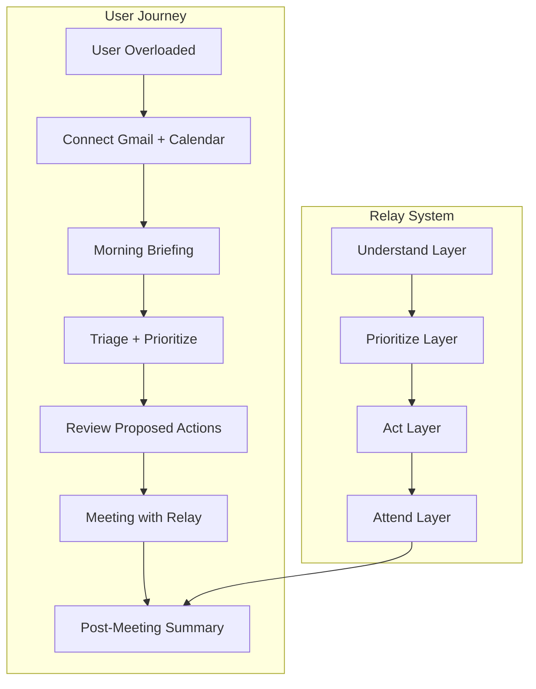

# Relay Hackathon Technical Plan

## 1. Product Architecture




**Core loop:** Ingest context (email, calendar, notes) → Prioritize (urgent vs important vs can wait) → Act (drafts, scheduling) → Attend (meeting presence) → Summarize (next steps, follow-ups).

**Disclosure principle:** Every AI action is labeled "Yassin's Relay" and every outbound item requires explicit approval before send.

---

## 2. Technical Architecture

```mermaid
flowchart LR
    subgraph client [Next.js Client]
        UI[shadcn/ui Components]
        State[Zustand / React Query]
    end
    
    subgraph api [Next.js API Routes]
        AuthAPI[/api/auth/*]
        GmailAPI[/api/gmail/*]
        CalendarAPI[/api/calendar/*]
        BriefingAPI[/api/briefing/*]
        ActionsAPI[/api/actions/*]
        MeetingAPI[/api/meeting/*]
        VoiceAPI[/api/voice/*]
    end
    
    subgraph services [Service Layer]
        GmailSvc[Gmail Service]
        CalendarSvc[Calendar Service]
        MeetingSvc[Meeting Service]
        VoiceSvc[Voice Service]
        AISvc[AI / LLM Service]
    end
    
    subgraph external [External]
        Google[Google APIs]
        ElevenLabs[ElevenLabs]
        DB[(Neon Postgres)]
    end
    
    UI --> State --> api
    api --> services
    GmailSvc --> Google
    CalendarSvc --> Google
    VoiceSvc --> ElevenLabs
    services --> DB
```


**Stack:**

- **Frontend:** Next.js 14 (App Router), TypeScript, Tailwind, shadcn/ui, dark theme
- **Backend:** Next.js API Routes, server actions where appropriate
- **Database:** Neon Postgres (serverless, Vercel-friendly)
- **Auth:** NextAuth.js with Google provider (reuses OAuth for Gmail/Calendar scopes)
- **AI:** OpenAI API (or Anthropic) for triage, drafting, summarization
- **Voice:** ElevenLabs text-to-speech (fallback: Web Speech API or pre-recorded audio)

---

## 3. Repo Folder Structure

```
relay/
├── app/
│   ├── (auth)/
│   │   └── login/page.tsx
│   ├── (dashboard)/
│   │   ├── layout.tsx              # Dark premium layout
│   │   ├── page.tsx                # Main briefing / triage view
│   │   ├── briefing/page.tsx       # Morning briefing
│   │   ├── actions/page.tsx        # Pending actions to approve
│   │   ├── meeting/page.tsx        # Meeting simulation / attendance
│   │   ├── history/page.tsx        # Action history / trust layer
│   │   ├── settings/page.tsx       # Profile, integrations, voice, autonomy
│   │   ├── onboarding/
│   │   │   └── page.tsx            # Train Relay – first-run onboarding
│   │   └── director/
│   │       └── page.tsx            # Relay Director – Make Demo Video
│   └── api/
│       ├── auth/[...nextauth]/route.ts   # NextAuth handles callback
│       ├── gmail/
│       │   ├── threads/route.ts
│       │   ├── messages/[id]/route.ts
│       │   └── send/route.ts
│       ├── calendar/
│       │   ├── events/route.ts
│       │   └── create/route.ts
│       ├── briefing/route.ts
│       ├── actions/
│       │   ├── route.ts            # CRUD for pending actions
│       │   ├── approve/[id]/route.ts
│       │   └── history/route.ts    # Audit log for trust layer
│       ├── meeting/
│       │   ├── join/route.ts
│       │   └── transcript/route.ts
│       ├── voice/
│       │   ├── generate/route.ts
│       │   └── preview/route.ts
│       ├── profile/route.ts
│       ├── onboarding/
│       │   ├── route.ts
│       │   └── questions/route.ts
│       ├── style/learn/route.ts
│       └── director/
│           ├── script/route.ts     # Generate demo script (hook, narration, scenes, ending)
│           ├── shot-list/route.ts  # Generate storyboard from script
│           ├── scenarios/route.ts  # List scenario presets + seed data
│           ├── replay-sequence/route.ts  # Deterministic click path for chosen scenario
│           └── narration-tts/route.ts    # TTS for narration (separate from meeting voice)
├── components/
│   ├── ui/                         # shadcn primitives
│   ├── briefing/
│   │   ├── BriefingCard.tsx
│   │   ├── InboxSummary.tsx
│   │   ├── CalendarSummary.tsx
│   │   └── PriorityList.tsx
│   ├── actions/
│   │   ├── ActionCard.tsx
│   │   ├── DraftReview.tsx
│   │   └── ApprovalButton.tsx
│   ├── meeting/
│   │   ├── MeetingSimulator.tsx
│   │   ├── RelayAvatar.tsx
│   │   └── VoicePlayer.tsx
│   ├── onboarding/
│   │   ├── OnboardingFlow.tsx      # Train Relay wizard
│   │   ├── OnboardingQuestion.tsx
│   │   └── VoiceOnboardingOption.tsx
│   ├── settings/
│   │   ├── ProfileCard.tsx
│   │   ├── VoiceSettingsCard.tsx   # default vs custom voice, preview
│   │   └── AutonomySettingsCard.tsx
│   ├── director/
│   │   ├── DirectorModal.tsx       # Or full page – scenario picker, duration, generate
│   │   ├── ScriptViewer.tsx        # Hook, narration, scene-by-scene, ending
│   │   ├── ShotListViewer.tsx      # Per-scene: page, UI section, action, result, zoom note
│   │   ├── NarrationViewer.tsx     # Narration text + optional TTS play
│   │   └── ExportButtons.tsx       # Copy script, copy shot list, export JSON
│   ├── layout/
│   │   ├── Sidebar.tsx
│   │   ├── Header.tsx
│   │   └── DemoModeIndicator.tsx   # Shown when mock voice/data active
├── lib/
│   ├── db/
│   │   ├── client.ts
│   │   └── schema.ts               # Drizzle or raw SQL types
│   ├── services/
│   │   ├── gmail.ts
│   │   ├── calendar.ts
│   │   ├── meeting.ts
│   │   ├── voice.ts
│   │   └── ai.ts
│   ├── mocks/
│   │   ├── gmail.ts
│   │   ├── calendar.ts
│   │   ├── meeting.ts
│   │   └── briefing.ts
│   ├── prompts/
│   │   ├── triage.ts
│   │   ├── briefing.ts
│   │   ├── actions.ts
│   │   ├── meeting.ts
│   │   ├── personalization.ts       # Profile injection for prompts
│   │   └── director.ts              # Demo script / shot list generation prompts
│   ├── security/
│   │   └── encryption.ts           # AES-256-GCM for refresh tokens
│   ├── demo/
│   │   ├── seed.ts                 # Base seeded demo data
│   │   ├── scenarios.ts            # Preset scenarios: Overwhelmed Morning, Inbox Rescue, Standup Handoff, Recovery After Missed Follow-Up
│   │   └── replay-sequences.ts     # Deterministic click paths per scenario (Playwright/Browserbase-ready)
│   ├── personalization/
│   │   ├── profile.ts              # Profile service
│   │   └── style-memory.ts         # Diff extraction, preference merge
│   ├── auth.ts
│   └── constants.ts
├── types/
│   └── index.ts
├── project.sql                     # Single schema file (reference)
├── .env.example
├── tailwind.config.ts
├── next.config.js
└── package.json
```

---

## 4. Database Schema (project.sql)

Single `project.sql` as the canonical schema. Tables:


| Table                 | Purpose                                                                                                                                                                                                                                                                                                                                                                                  |
| --------------------- | ---------------------------------------------------------------------------------------------------------------------------------------------------------------------------------------------------------------------------------------------------------------------------------------------------------------------------------------------------------------------------------------- |
| `users`               | id, email, name, google_refresh_token_encrypted (TEXT – encrypted at rest via lib/security/encryption.ts), created_at                                                                                                                                                                                                                                                                    |
| `sessions`            | id, user_id, started_at, briefing_snapshot (JSONB), created_at                                                                                                                                                                                                                                                                                                                           |
| `pending_actions`     | id, session_id, type (draft_email, create_event, follow_up), payload (JSONB), status (pending, approved, rejected), created_at                                                                                                                                                                                                                                                           |
| `action_executions`   | id, pending_action_id, user_id, proposed_action_payload (JSONB), edited_payload (JSONB), approved_at (timestamptz), executed_at (timestamptz), execution_status (success, failed), error_message (TEXT)                                                                                                                                                                                  |
| `meeting_attendances` | id, session_id, event_id, transcript_snapshot, relay_update_text, voice_audio_url, created_at                                                                                                                                                                                                                                                                                            |
| `briefings`           | id, session_id, inbox_summary (JSONB), calendar_summary (JSONB), priorities (JSONB), created_at                                                                                                                                                                                                                                                                                          |
| `user_profiles`       | id, user_id (FK), display_name, role, timezone, communication_style, preferred_tone, audience_tones (JSONB), autonomy_mode, auto_approve_rules (JSONB), protected_actions (JSONB), work_hours (JSONB), focus_windows (JSONB), meeting_update_style, voice_enabled, voice_provider, voice_id, voice_consent_status, style_memory (JSONB), onboarding_completed_at, created_at, updated_at |
| `style_learnings`     | id, user_id, original_text, edited_text, context, extracted_preference (JSONB), created_at                                                                                                                                                                                                                                                                                               |


Indexes on `user_id`, `session_id`, `status`, `approved_at`, `user_profiles.user_id`. Use `uuid` for IDs, `timestamptz` for timestamps.

---

## 5. API Route Design


| Route                           | Method     | Purpose                                                                                                      |
| ------------------------------- | ---------- | ------------------------------------------------------------------------------------------------------------ |
| `/api/auth/[...nextauth]`       | *          | NextAuth Google OAuth with scopes: gmail.readonly, gmail.send, gmail.modify, calendar, calendar.events       |
| `/api/gmail/threads`            | GET        | List recent threads (paginated, mock if no token)                                                            |
| `/api/gmail/messages/[id]`      | GET        | Fetch single message body                                                                                    |
| `/api/gmail/send`               | POST       | Send email (only after action approval)                                                                      |
| `/api/calendar/events`          | GET        | List events for date range                                                                                   |
| `/api/calendar/create`          | POST       | Create event (only after approval)                                                                           |
| `/api/briefing`                 | GET        | Generate morning briefing (inbox + calendar + priorities)                                                    |
| `/api/actions`                  | GET, POST  | List/create pending actions                                                                                  |
| `/api/actions/approve/[id]`     | POST       | Approve and execute; writes action_executions; if edited_payload differs from proposed, triggers style/learn |
| `/api/actions/history`          | GET        | List action_executions for trust layer / history UI                                                          |
| `/api/meeting/join`             | POST       | Simulate or trigger meeting bot join                                                                         |
| `/api/meeting/transcript`       | POST       | Submit transcript for post-meeting summary                                                                   |
| `/api/voice/generate`           | POST       | Generate TTS for Relay update (body: text)                                                                   |
| `/api/profile`                  | GET, PATCH | Get or update user profile                                                                                   |
| `/api/onboarding`               | GET, POST  | Get onboarding state; submit onboarding answers (Train Relay)                                                |
| `/api/onboarding/questions`     | GET        | Return 6–10 onboarding questions                                                                             |
| `/api/voice/preview`            | POST       | Preview TTS before meeting (required before simulator speech)                                                |
| `/api/style/learn`              | POST       | Submit edited draft; extract and store preference from diff                                                  |
| `/api/director/script`          | POST       | Generate demo script (body: scenario, duration 30                                                            |
| `/api/director/shot-list`       | POST       | Generate storyboard from script; returns per-scene: page, ui_section, action, expected_result, zoom_note     |
| `/api/director/scenarios`       | GET        | List scenario presets + seeded demo data                                                                     |
| `/api/director/replay-sequence` | GET        | Deterministic click path for chosen scenario (Playwright/Browserbase-ready JSON)                             |
| `/api/director/narration-tts`   | POST       | TTS for narration text (separate from meeting voice)                                                         |


All routes require auth. Use `getServerSession` and validate `userId` before DB/API access.

---

## 6. OAuth / Integration Design

**Unified Google OAuth:**

- Use NextAuth.js Google provider with extended scopes.
- Scopes: `https://www.googleapis.com/auth/gmail.readonly`, `https://www.googleapis.com/auth/gmail.send`, `https://www.googleapis.com/auth/gmail.modify`, `https://www.googleapis.com/auth/calendar`, `https://www.googleapis.com/auth/calendar.events`.
- **Refresh token storage:** Refresh tokens must be **encrypted at rest**, not hashed. Hashing is one-way and cannot be reversed; we need to decrypt the token for OAuth refresh. Store in `users.google_refresh_token_encrypted` using `lib/security/encryption.ts` (AES-256-GCM with a key from `ENCRYPTION_KEY` env). On read, decrypt before passing to `googleapis` OAuth2 client.
- Use `googleapis` npm package: `google.gmail()`, `google.calendar()` with OAuth2 client.

**Flow:**

1. User clicks "Connect Gmail + Calendar".
2. Redirect to Google consent; user grants scopes.
3. NextAuth callback receives tokens; encrypt refresh token and persist to `users`; redirect to dashboard.
4. API routes fetch user, decrypt refresh token, obtain access token, and call Gmail/Calendar APIs.

**Fallback:** If no valid token, return mock data (see Section 12).

---

## 7. Component Map

```mermaid
flowchart TB
    Layout[Layout + Sidebar]
    BriefingPage[Briefing Page]
    ActionsPage[Actions Page]
    MeetingPage[Meeting Page]
    HistoryPage[History Page]
    
    Layout --> BriefingPage
    Layout --> ActionsPage
    Layout --> MeetingPage
    Layout --> HistoryPage
    Layout --> SettingsPage
    Layout --> OnboardingPage
    Layout --> DirectorPage
    
    BriefingPage --> BriefingCard
    BriefingPage --> InboxSummary
    BriefingPage --> CalendarSummary
    BriefingPage --> PriorityList
    
    InboxSummary --> ThreadRow
    CalendarSummary --> EventRow
    PriorityList --> PriorityItem
    
    ActionsPage --> ActionCard
    ActionCard --> DraftReview
    ActionCard --> ApprovalButton
    
    MeetingPage --> MeetingSimulator
    MeetingSimulator --> RelayAvatar
    MeetingSimulator --> VoicePlayer
    
    SettingsPage --> ProfileCard
    SettingsPage --> VoiceSettingsCard
    SettingsPage --> AutonomySettingsCard
    OnboardingPage --> OnboardingFlow
    DirectorPage --> ScriptViewer
    DirectorPage --> ShotListViewer
    DirectorPage --> NarrationViewer
    DirectorPage --> ExportButtons
```




**Key components:**

- **BriefingCard:** Hero card with "Good morning" + date, key stats.
- **InboxSummary:** List of critical threads with subject, sender, snippet; click to expand.
- **CalendarSummary:** Today's events; highlight conflicts and upcoming standup.
- **PriorityList:** Urgent / Important / Can wait with checkboxes.
- **ActionCard:** Shows draft or proposed event; Approve / Edit / Reject.
- **MeetingSimulator:** Simulated meeting UI with "Yassin's Relay" avatar, play button for spoken update, transcript area.
- **HistoryPage:** Trust layer – lists action_executions with proposed vs edited payload, approved_at, executed_at, status, errors.
- **OnboardingFlow:** Train Relay wizard – 6–10 questions; text + optional voice.
- **VoiceSettingsCard:** Default built-in vs custom voice; provider + voice_id + consent; preview before meeting.
- **AutonomySettingsCard:** auto_approve_rules, protected_actions.
- **DemoModeIndicator:** Shown in layout when mock voice/data active.
- **PriorityItem:** Include "Why this priority surfaced" explanation (tooltip or expand).
- **DirectorModal / DirectorPage:** "Make Demo Video" – scenario picker, duration (30/60/90 sec), generated script, shot list, narration, copy/export buttons.
- **ScriptViewer, ShotListViewer, NarrationViewer:** Display generated content; NarrationViewer has optional TTS play per scene.

---

## 8. State Management Plan

- **Server state:** React Query (TanStack Query) for API data (briefing, threads, events, pending actions). Cache 5 min; refetch on focus for actions.
- **Client state:** Zustand (lightweight) for:
  - Selected thread/event for detail view
  - Playback state for voice (playing, paused)
  - Sidebar collapse, theme (if we add light mode later)
- **Form state:** React Hook Form for draft editing.
- **URL state:** Next.js searchParams for filters (e.g., `?view=briefing` vs `?view=actions`).

No Redux. Keep it minimal.

---

## 9. Meeting Layer Design

**Hackathon scope: Meeting simulator only.** Do not spend build time on real meeting bot plumbing. Real Zoom / Meet / Teams bot support is **post-hackathon only** – implement only if Phase 0–6 are complete and time remains.

**Implementation:** `MeetingSimulator` – in-app UI showing a simulated meeting room. User pastes meeting URL or uses a canned "Standup" event. "Join" animates Relay avatar; play pre-generated or live ElevenLabs audio for the update. Transcript area for manual paste; post-meeting summary from that transcript.

**Post-hackathon (out of scope for build):** Zoom Meeting SDK, Meeting BaaS, Google Meet headless joiners, etc.

---

## 10. Voice Layer Design with Fallback Strategy

**Abstraction:** `VoiceService` interface:

- `generateUpdate(text: string, voiceId?: string): Promise<ArrayBuffer>`

**Tiers:**


| Tier           | Implementation                                                                                                                                                                                                 | When |
| -------------- | -------------------------------------------------------------------------------------------------------------------------------------------------------------------------------------------------------------- | ---- |
| **Primary**    | ElevenLabs API – `POST /v1/text-to-speech/{voice_id}`. Use `eleven_multilingual_v2` or `eleven_flash_v2_5` for low latency. Voice: pre-made "professional" or "narrative" from library (no cloning for speed). |      |
| **Fallback 1** | Web Speech API (browser) – `speechSynthesis` for basic TTS if ElevenLabs fails or no API key.                                                                                                                  |      |
| **Fallback 2** | Pre-recorded sample – 15–30 sec "Yassin's Relay" placeholder for demo if both fail.                                                                                                                            |      |


**Voice settings:** Voice settings page (VoiceSettingsCard) offers default built-in mode or optional custom (provider + voice_id). Store provider, voice_id, consent metadata; do not store raw voice assets in repo. Require preview flow before meeting simulator speech.

---

## 10a. User Personalization System

**Principle:** Prioritize personalization only if it does not disrupt the flagship demo path. Keep implementation lightweight and hackathon-friendly.

### 10a.1 Train Relay Onboarding

- First-run flow: "Train Relay" – shown when `user_profiles.onboarding_completed_at` is null.
- **Text-based:** 6–10 concise questions. Support both text input and optional voice input (record answer, transcribe, or type).
- **Topics:** communication_style, tone by audience type (boss, teammate, professor, recruiter), overwhelm patterns, work_hours/focus_times, calendar preferences, auto_approve_rules, protected_actions.
- Store answers in `user_profiles`; set `onboarding_completed_at`. Skippable for demo (use seeded profile).

### 10a.2 User Profile Model (user_profiles)


| Field                | Type    | Purpose                                |
| -------------------- | ------- | -------------------------------------- |
| display_name         | TEXT    | "Good morning, {display_name}"         |
| role                 | TEXT    | Context for drafting                   |
| timezone             | TEXT    | IANA timezone                          |
| communication_style  | TEXT    | concise, detailed, etc.                |
| preferred_tone       | TEXT    | professional, casual, etc.             |
| audience_tones       | JSONB   | { boss: "formal", teammate: "casual" } |
| autonomy_mode        | TEXT    | conservative, balanced, assertive      |
| auto_approve_rules   | JSONB   | Types safe to auto-handle              |
| protected_actions    | JSONB   | Types that always need approval        |
| work_hours           | JSONB   | { start, end } or similar              |
| focus_windows        | JSONB   | Do-not-disturb blocks                  |
| meeting_update_style | TEXT    | Bullet-point, narrative, etc.          |
| voice_enabled        | BOOLEAN |                                        |
| voice_provider       | TEXT    | elevenlabs, builtin                    |
| voice_id             | TEXT    | Provider's voice ID                    |
| voice_consent_status | TEXT    | granted, pending, declined             |
| style_memory         | JSONB   | Merged preferences from edits          |


### 10a.3 Learning from Edits (Style Memory)

- When user edits a draft and approves: store `original_text` (proposed) and `edited_text` (final) in `style_learnings`.
- Run lightweight diff → extract preference (e.g., "shorter sentences", "more formal sign-off"). Simple rule-based or one LLM call. Merge into `user_profiles.style_memory`.
- Future drafts: include style_memory in prompt context. No complex ML; prompt engineering only.

### 10a.4 Personalization in Output

- Briefings, summaries, drafts: inject `display_name`, `communication_style`, `audience_tones`, `style_memory` into prompts.
- Meeting updates: use `meeting_update_style`, tone preferences.
- All outputs feel tailored; avoid generic phrasing when profile exists.

### 10a.5 Voice Setup Architecture

- **Voice settings page:** Part of settings. VoiceSettingsCard with:
  - **Default built-in:** Use system/Web Speech or pre-made ElevenLabs library voice. No custom assets.
  - **Optional custom:** Store `voice_provider` + `voice_id` + `voice_consent_status`. Do NOT store raw voice assets in repo.
- **Preview flow:** Before any meeting simulator speech, require user to hit "Preview" and hear sample. Confirms consent and avoids surprise.
- lib/prompts: include profile voice preferences in meeting update generation.

### 10a.6 UI Additions

- Train Relay onboarding flow (skippable)
- Profile/settings page with ProfileCard, VoiceSettingsCard, AutonomySettingsCard
- "Why this priority surfaced" on PriorityList items
- Demo Mode indicator in layout when mock voice/data active

---

## 10b. Relay Director – Demo Video Planning

**Concept:** Relay can create the plan for its own product demo video. High-impact, demo-friendly; shows Relay "directing" its own ad.

**Scope discipline:** No video editing, no rendering, no cinematic post-production. Focus on script, storyboard, demo data, replayable flow.

### 10b.1 Demo Script Generation

- Page or modal: "Make Demo Video" (settings or dashboard entry point).
- **Duration:** 30 sec, 60 sec, 90 sec.
- **Output:** hook, narration, scene-by-scene script, ending reveal line.
- **Quality:** Product-marketing, not generic AI fluff. Use lib/prompts/director.ts with strong product framing.

### 10b.2 Storyboard / Shot List

- Per scene: page to open, UI section to focus on, exact user action, expected on-screen result, suggested zoom/focus note.
- Production-ready shot list; `/api/director/shot-list` derives from script + scenario.

### 10b.3 Demo Data Generator & Scenario Presets

- lib/demo/scenarios.ts: Preset scenarios with believable seeded data.
- **Overwhelmed Morning:** urgent emails, calendar conflicts, standup soon.
- **Inbox Rescue:** backlog triage, critical threads, draft replies.
- **Standup Handoff:** meeting in 5 min, Relay prepares update, joins, summarizes.
- **Recovery After Missed Follow-Up:** missed email, draft apology, reschedule.
- Each scenario: gmail threads, calendar events, standup updates, action items, follow-up drafts. Believable, cohesive.

### 10b.4 Replayable Browser Flow

- lib/demo/replay-sequences.ts: Deterministic click path per scenario.
- Structure: array of { route, selector, action, expectedResult, narration?, durationMs }.
- Ready for Cursor Browser, Playwright MCP, Browserbase MCP. Do not implement full external automation; just structure the data.

### 10b.5 Voice / Narration Support

- Generate narration text per scene.
- Optional TTS for full narration or selected scenes via `/api/director/narration-tts`.
- Separate from meeting simulator voice (different context, different endpoint).

### 10b.6 UI

- "Make Demo Video" button in settings or dashboard.
- Show: selected scenario, duration, generated script, shot list, narration.
- Copy/export buttons for script, shot list, replay JSON.

---

## 11. Phased Build Order (24–36 Hour Hackathon) – Demo-First

Live integrations come **after** the core demoable product exists.


| Phase                        | Hours | Deliverables                                                                                                                                                                                              | Definition of Done                                                                                                                     |
| ---------------------------- | ----- | --------------------------------------------------------------------------------------------------------------------------------------------------------------------------------------------------------- | -------------------------------------------------------------------------------------------------------------------------------------- |
| **0. Scaffold**              | 0–2   | Next.js, Tailwind, shadcn, Neon, project.sql, .env.example, app shell, dark theme, main navigation, seeded demo data                                                                                      | App runs; sidebar shows Briefing, Actions, Meeting, History; `/` loads; mock data returns from seed                                    |
| **1. Briefing UI**           | 2–3   | Briefing page, InboxSummary, CalendarSummary, PriorityList, lib/mocks for gmail + calendar + briefing                                                                                                     | User sees "Good morning" card, inbox threads, today's events, priority list; all from mock data                                        |
| **2. Actions Approval**      | 3–4   | ActionCard, DraftReview, ApprovalButton, mock draft email and mock calendar suggestion, approve flow                                                                                                      | User can approve a draft email and a calendar suggestion; actions move to "approved"; mock execution                                   |
| **3. Meeting Simulator**     | 2–3   | MeetingSimulator, RelayAvatar, transcript area, VoicePlayer, pre-recorded sample                                                                                                                          | User clicks "Join standup"; Relay avatar appears; voice plays; transcript can be pasted; summary shown                                 |
| **4. AI Wiring**             | 2–3   | lib/prompts (triage, briefing, actions, meeting), AI service, wire to briefing and actions                                                                                                                | Briefing priorities and draft suggestions come from LLM when API key present; fallback to mock if not                                  |
| **4.5 Personalization**      | 1–2   | user_profiles, Train Relay (skippable), settings page, VoiceSettingsCard, AutonomySettingsCard, DemoModeIndicator, "Why this priority", wire profile into prompts                                         | User completes onboarding; settings shows profile + voice + autonomy; briefings use display_name; demo mode indicator when mock active |
| **5. Live Gmail + Calendar** | 2–4   | OAuth, encryption, Gmail/Calendar services, token storage, API routes                                                                                                                                     | User connects Google; real inbox/calendar shown; approve actually sends email / creates event                                          |
| **6. Polish + Demo**         | 2–4   | Loading states, error handling, responsiveness, history page, style memory, voice preview, flagship script; Relay Director (scenario presets, script gen, shot list, replay sequence, Make Demo Video UI) | Full demo path rehearsed; Relay Director generates script + shot list; replay JSON exportable; no broken states                        |


**Auth note:** Phases 0–4 use demo mode (no auth or optional stub session). Phase 5 adds NextAuth + OAuth for live Gmail/Calendar.

**Personalization note:** Phase 4.5 does not block the flagship demo. If time is short, ship Phase 4 → 5 → 6 with minimal personalization (display_name in seed, skip onboarding).

---

## 12. Mock vs Live


| Feature         | Build Live             | Mock                                           |
| --------------- | ---------------------- | ---------------------------------------------- |
| Gmail read      | Yes (if OAuth works)   | Yes – canned threads in `lib/mocks/gmail.ts`   |
| Gmail send      | Yes (after approval)   | No – real send or explicit "simulated" badge   |
| Calendar read   | Yes                    | Yes – canned events                            |
| Calendar create | Yes (after approval)   | No – real create or simulated badge            |
| Meeting join    | No (simulator only)    | Yes – full meeting flow is simulated           |
| Voice           | Yes (ElevenLabs)       | Yes – Web Speech API or pre-recorded           |
| AI triage/draft | Yes (OpenAI/Anthropic) | Optional – rule-based fallback if rate limited |


**Mock data:** `lib/mocks/gmail.ts`, `calendar.ts`, `meeting.ts`, `briefing.ts` return realistic structures. API routes check for valid tokens; if none, return mock.

---

## 13. Exact Flagship Demo Script

**Setup (before demo):** 

- One Gmail account with 5–10 realistic threads (urgent, important, can-wait mix).
- Calendar with today: standup 9:00, conflict at 10:30, 1:1 at 2:00.
- Pre-generated voice sample for standup update.

**Script (4–5 min):**

1. **"This is Relay. I'm overwhelmed."** (0:00) – Open app, show briefing page.
2. **"Relay read my inbox and calendar."** (0:30) – Point to InboxSummary + CalendarSummary.
3. **"It flagged 2 urgent emails and a schedule conflict."** (1:00) – Expand priority list, show conflict callout.
4. **"It drafted a reply for me."** (1:30) – Go to Actions, open DraftReview.
5. **"I approve and send."** (2:00) – Click Approve, show confirmation.
6. **"Now standup. Yassin's Relay attends as a disclosed bot."** (2:30) – Open Meeting page, click "Join standup".
7. **"Relay gives my update in my voice."** (3:00) – Play voice sample. Show "Yassin's Relay" label clearly.
8. **"After the meeting, I get a summary and next steps."** (3:30) – Show post-meeting summary, suggested follow-up.
9. **"That's Relay – my AI chief-of-staff for overload moments."** (4:00)
10. **(Optional) "Relay even plans its own demo video."** – Open Relay Director, show generated script and shot list.

---

## 14. Cut List (If Time Runs Short)


| Priority | Cut                       | Impact                                     |
| -------- | ------------------------- | ------------------------------------------ |
| 1        | Calendar create           | Demo works with email draft only           |
| 2        | Multiple action types     | Keep only email draft                      |
| 3        | Live Gmail/Calendar       | Use mock data; demo narrative unchanged    |
| 4        | Voice live generation     | Use pre-recorded sample only               |
| 5        | Post-meeting AI summary   | Show static template                       |
| 6        | Train Relay onboarding    | Use seeded profile; skip first-run flow    |
| 7        | Style memory / edit learn | Drafts use profile only; no learning       |
| 8        | Voice settings (custom)   | Default built-in only                      |
| 9        | Relay Director            | Use pre-written script; skip AI generation |
| 10       | Notes / brain dump ingest | Out of scope for flagship                  |


**Never cut:** Briefing UI, at least one approved action (email draft), meeting simulator with Relay disclosure, voice playback, DemoModeIndicator (builds trust).

---

## 15. Feature → Judging Criteria Mapping


| Judging Criteria        | Relay Features                                                                                                            |
| ----------------------- | ------------------------------------------------------------------------------------------------------------------------- |
| **Innovation**          | Disclosed meeting bot, voice-in-user-style, triage + act loop, personalization, Relay Director (plans its own demo video) |
| **Impact**              | Solves real overload problem; inbox + calendar + meeting in one flow; tailored to user                                    |
| **Usability**           | Approval before send, clear "Yassin's Relay" disclosure, personalization controls, Demo Mode indicator                    |
| **Technical execution** | OAuth, Gmail/Calendar APIs, structured DB, service abstractions                                                           |
| **Implementation**      | Working end-to-end: connect → brief → act → attend → summarize                                                            |
| **Presentation**        | Polished dark UI, 4-min script, one coherent story; Relay Director makes demo planning believable                         |


---

## 16. Implementation Command – Exact Build Order for Cursor

**First files to scaffold (in order):**

1. `package.json` – Next.js 14, TypeScript, Tailwind, shadcn/ui, Neon, NextAuth, googleapis, openai
2. `next.config.js`, `tailwind.config.ts`, `tsconfig.json`
3. `.env.example` – DATABASE_URL, NEXTAUTH_SECRET, GOOGLE_CLIENT_ID, GOOGLE_CLIENT_SECRET, ENCRYPTION_KEY, OPENAI_API_KEY, ELEVENLABS_API_KEY
4. `project.sql` – users, sessions, pending_actions, action_executions, meeting_attendances, briefings, user_profiles, style_learnings
5. `lib/db/client.ts` – Neon client
6. `lib/constants.ts` – app name, bot label "Yassin's Relay"
7. `app/layout.tsx`, `app/globals.css` – root layout, dark theme
8. `app/(dashboard)/layout.tsx` – Sidebar, Header
9. `components/layout/Sidebar.tsx`, `components/layout/Header.tsx`
10. `lib/demo/seed.ts` – seeded threads, events, priorities
11. `lib/demo/scenarios.ts` – Overwhelmed Morning, Inbox Rescue, Standup Handoff, Recovery After Missed Follow-Up
12. `lib/mocks/gmail.ts`, `lib/mocks/calendar.ts`, `lib/mocks/meeting.ts`, `lib/mocks/briefing.ts`

**First pages/components (in order):**

1. `app/(dashboard)/page.tsx` – redirect or landing to briefing
2. `app/(dashboard)/briefing/page.tsx` – fetches from `/api/briefing`
3. `components/briefing/BriefingCard.tsx`, `InboxSummary.tsx`, `CalendarSummary.tsx`, `PriorityList.tsx`
4. `app/api/briefing/route.ts` – returns mock briefing (Phase 1)
5. `app/(dashboard)/actions/page.tsx` – fetches from `/api/actions`
6. `components/actions/ActionCard.tsx`, `DraftReview.tsx`, `ApprovalButton.tsx`
7. `app/api/actions/route.ts`, `app/api/actions/approve/[id]/route.ts` – mock approve
8. `app/(dashboard)/meeting/page.tsx` – MeetingSimulator
9. `components/meeting/MeetingSimulator.tsx`, `RelayAvatar.tsx`, `VoicePlayer.tsx`
10. `app/api/meeting/join/route.ts`, `app/api/meeting/transcript/route.ts`
11. `app/(dashboard)/history/page.tsx` – fetches from `/api/actions/history`
12. `app/api/actions/history/route.ts`
13. (Phase 4.5) `lib/personalization/profile.ts`, `style-memory.ts` → user_profiles in project.sql → `/api/profile`, `/api/onboarding`, `/api/style/learn` → Train Relay page, settings page with VoiceSettingsCard, AutonomySettingsCard, DemoModeIndicator
14. (Phase 6) Wire style memory into approve flow; add voice preview before meeting
15. (Phase 6) Relay Director: `lib/demo/replay-sequences.ts`, `lib/prompts/director.ts` → `/api/director/`* → director page, ScriptViewer, ShotListViewer, NarrationViewer, ExportButtons; "Make Demo Video" in settings

**Exact Cursor coding order:** Scaffold 1–12 → Briefing → Actions → Meeting → History → lib/prompts + AI wiring → personalization → Relay Director (scenarios, script, shot list, replay) → lib/security + OAuth → Gmail/Calendar → polish.

## Decisions Summary

- **Database:** Neon Postgres, single `project.sql`; `action_executions` for trust/audit
- **Token storage:** Encrypted at rest (AES-256-GCM), not hashed; decrypt for OAuth refresh
- **Auth:** NextAuth.js + Google; callback via `[...nextauth]` only
- **Meeting:** Simulator only for hackathon; real Zoom/Meet/Teams = post-hackathon
- **Voice:** ElevenLabs primary; Web Speech API / pre-recorded fallback
- **Build order:** Demo-first; live Gmail/Calendar after core UI is demoable
- **Personalization:** user_profiles, Train Relay (skippable), style memory, voice settings; does not block flagship demo
- **Relay Director:** Demo video planning – script, shot list, scenario presets, replayable flow; no video editing/rendering

