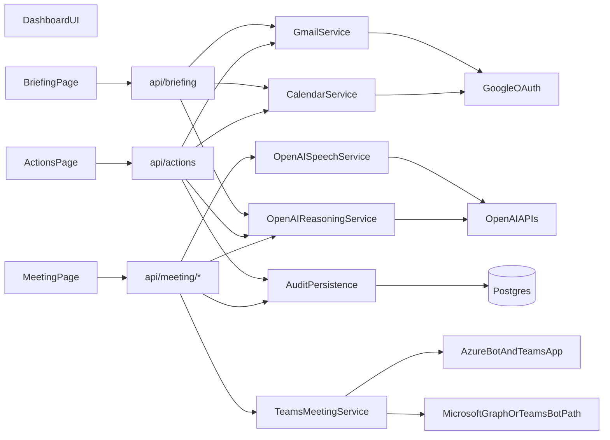

# Relay Teams-Only Revised Plan

## What Stays

The current polished product shell should stay in place. The key decision is to preserve the existing page/API contracts where possible and replace mock internals behind them.

Files to preserve as stable UI surfaces:

- [app/(dashboard)/briefing/page.tsx](app/(dashboard)/briefing/page.tsx)
- [app/(dashboard)/actions/page.tsx](app/(dashboard)/actions/page.tsx)
- [components/briefing/BriefingCard.tsx](components/briefing/BriefingCard.tsx)
- [components/briefing/InboxSummary.tsx](components/briefing/InboxSummary.tsx)
- [components/briefing/CalendarSummary.tsx](components/briefing/CalendarSummary.tsx)
- [components/briefing/PriorityList.tsx](components/briefing/PriorityList.tsx)
- [components/actions/ActionsPageHeader.tsx](components/actions/ActionsPageHeader.tsx)
- [components/actions/ActionCard.tsx](components/actions/ActionCard.tsx)
- [components/actions/DraftReview.tsx](components/actions/DraftReview.tsx)
- [components/layout/Sidebar.tsx](components/layout/Sidebar.tsx)
- [app/(dashboard)/layout.tsx](app/(dashboard)/layout.tsx)

These pages already consume API boundaries cleanly, which is the main preservation lever:

```9:18:app/(dashboard)/briefing/page.tsx
async function fetchBriefing() {
  const res = await fetch("/api/briefing")
  if (!res.ok) throw new Error("Failed to load briefing")
  return res.json()
}
```

```8:18:app/(dashboard)/actions/page.tsx
async function fetchActions() {
  const res = await fetch("/api/actions")
  if (!res.ok) throw new Error("Failed to load actions")
  return res.json() as Promise<PendingAction[]>
}
```

## Revised Architecture




Target service boundaries:

- `GoogleAuthService`: user Google OAuth, refresh token encryption/decryption, access token refresh.
- `GmailService`: read threads, fetch message bodies, send approved drafts.
- `CalendarService`: list events, detect conflicts, extract Teams join URLs from Google Calendar events, reschedule approved events.
- `OpenAIReasoningService`: generate briefing summaries, triage priorities, draft actions, meeting updates, and post-meeting summaries using GPT-5.4.
- `OpenAISpeechService`: STT for recorded or streamed meeting audio artifacts and TTS for Relay’s spoken update.
- `TeamsMeetingService`: join a Teams meeting as disclosed `Yassin’s Relay`, manage meeting state, ingest transcript/media through the Teams-supported path, request TTS playback, and persist meeting artifacts.
- `AuditPersistence`: store pending actions, executions, meeting attendance, transcripts, spoken outputs, and failure states.

Microsoft auth strategy for the hackathon path:

- Use `tenant-installed Teams bot/app only` as the primary implementation path.
- Do not require user-scoped Microsoft sign-in for the first live hackathon slice unless a Teams capability proves impossible without it.
- Rationale: the product already needs user-scoped Google auth for Gmail + Calendar, while Teams participation is better treated as an installed tenant bot capability for the simplest shippable live path.
- Consequence: Microsoft credentials remain server-side app credentials, and the initial schema does not need per-user Microsoft refresh tokens.

## Teams-Only Meeting Architecture

The simulator-first assumption in [AGENTS.md](AGENTS.md) now overrides the old plan. The Meeting phase should be redefined around one real vertical slice:

- Relay detects a real Teams meeting from Google Calendar.
- User opens the Meeting page and sees one live upcoming Teams meeting.
- Relay joins as a disclosed participant named `Yassin’s Relay`.
- Relay receives transcript or media through the real Teams bot/media integration path.
- Relay generates a short meeting update from briefing context and recent meeting input.
- Relay speaks that update using OpenAI TTS.
- Relay stores a post-meeting summary and next steps.

Planned implementation stance:

- Primary path: real Teams app/bot + Azure-hosted callback path + Teams-supported meeting join and transcript/media ingestion.
- Meeting identity: always disclosed as `Yassin’s Relay`; no impersonation, no pretending to be the human.
- Provider scope: Teams only. Google Meet and Zoom are out of scope.
- Auth path: tenant-installed Teams bot/app only for the hackathon slice; revisit user-scoped Microsoft auth only if a blocking Teams permission or join constraint forces it.

## Revised Phased Build Order

### Phase A. Stabilize Existing Vertical Slice

Goal: preserve shipped polish while preparing live integrations.

- Keep [app/(dashboard)/briefing/page.tsx](app/(dashboard)/briefing/page.tsx) and [app/(dashboard)/actions/page.tsx](app/(dashboard)/actions/page.tsx) intact at the UI layer.
- Refactor mock data access into swappable service modules, but keep route signatures stable.
- Replace placeholder infra files like [lib/db/client.ts](lib/db/client.ts) with real service scaffolding.

Definition of done:

- Briefing and Actions still render with current design and can switch between mock/live service backends.

### Phase A.5. Teams Proof-of-Life Spike

Goal: validate the external Teams path before major coding begins.

- Complete Azure app registration and bot registration for Relay.
- Stand up a public HTTPS webhook endpoint that Teams/Azure can reach.
- Validate Teams app packaging and install path in the target tenant.
- Identify one real Teams meeting target for development and demo verification.
- Prove that Relay can at least begin the real join workflow or receive the required callback/webhook events from the real Teams path.
- Document any tenant permission, policy, or media/transcript blockers before moving into major implementation.

Definition of done:

- This phase is a feasibility checkpoint, not a polished product phase.
- Azure app/bot registration is completed.
- Public HTTPS webhook is reachable from the Teams/Azure path.
- Teams app install is validated in the target tenant.
- One real Teams meeting target is identified.
- Relay can begin the real join workflow or receive the required real callback/webhook events.

### Phase B. Real Google + Persistence Foundation

Goal: make Gmail and Google Calendar real before Teams, because Teams relies on real meeting discovery and real action execution.

Start condition:

- Begin Phase B only after Phase A.5 is completed or its blockers are explicitly documented.
- Add Google OAuth in [app/api/auth/[...nextauth]/route.ts](app/api/auth/[...nextauth]/route.ts).
- Add encrypted token handling in [lib/security/encryption.ts](lib/security/encryption.ts).
- Add real services:
  - [lib/services/google-auth.ts](lib/services/google-auth.ts)
  - [lib/services/gmail.ts](lib/services/gmail.ts)
  - [lib/services/calendar.ts](lib/services/calendar.ts)
- Update [app/api/briefing/route.ts](app/api/briefing/route.ts) to use live Gmail/Calendar first and explicit mock fallback only when auth is missing.
- Upgrade Actions routes to persist to DB and execute real Gmail send / Calendar reschedule on approval.

Definition of done:

- Relay can connect Google, read real inbox/calendar, generate a live briefing, and execute one real approved draft email and one real calendar reschedule.

### Phase C. OpenAI Reasoning + Speech Layer

Goal: replace canned logic and ElevenLabs assumptions with OpenAI-only reasoning/speech.

- Add:
  - [lib/services/openai-reasoning.ts](lib/services/openai-reasoning.ts)
  - [lib/services/openai-speech.ts](lib/services/openai-speech.ts)
  - [lib/prompts/briefing.ts](lib/prompts/briefing.ts)
  - [lib/prompts/actions.ts](lib/prompts/actions.ts)
  - [lib/prompts/meeting.ts](lib/prompts/meeting.ts)
- Use GPT-5.4 for briefing synthesis, priority ranking, action drafting, meeting update generation, and post-meeting summaries.
- Use OpenAI STT for meeting audio artifacts or chunks and OpenAI TTS for spoken Relay updates.
- Keep keys server-side only; no client-side direct API calls.

Definition of done:

- Briefing and Actions data come from live Gmail/Calendar plus GPT-5.4 reasoning, with OpenAI TTS/STT services ready for the meeting path.

### Phase D. Real Teams Join-and-Speak Vertical Slice

Goal: one real Teams meeting end-to-end, not a simulator.

- Replace [app/(dashboard)/meeting/page.tsx](app/(dashboard)/meeting/page.tsx) with a real operational page showing:
  - next Teams meeting
  - join eligibility/status
  - disclosed bot identity
  - transcript/media status
  - generated update preview
  - speak action / delivery status
  - post-meeting summary
- Add Teams meeting APIs:
  - [app/api/meeting/upcoming/route.ts](app/api/meeting/upcoming/route.ts)
  - [app/api/meeting/join/route.ts](app/api/meeting/join/route.ts)
  - [app/api/meeting/status/[id]/route.ts](app/api/meeting/status/[id]/route.ts)
  - [app/api/meeting/update/[id]/route.ts](app/api/meeting/update/[id]/route.ts)
  - [app/api/meeting/summary/[id]/route.ts](app/api/meeting/summary/[id]/route.ts)
  - [app/api/teams/webhook/route.ts](app/api/teams/webhook/route.ts)
- Add Teams service layer:
  - [lib/services/teams.ts](lib/services/teams.ts)
  - [lib/services/teams-manifest.ts](lib/services/teams-manifest.ts) or app packaging helper
  - [lib/services/meeting-orchestrator.ts](lib/services/meeting-orchestrator.ts)

Definition of done:

- From a Google Calendar event containing a Teams link, Relay can surface the meeting, join as `Yassin’s Relay`, deliver one short spoken update using OpenAI TTS, persist meeting status, and produce a post-meeting summary from the real Teams transcript/media path available in the environment.

### Phase E. Trust Layer, History, and Polish

Goal: make the product hackathon-credible and reviewable.

- Implement [app/(dashboard)/history/page.tsx](app/(dashboard)/history/page.tsx) and [app/api/actions/history/route.ts](app/api/actions/history/route.ts).
- Add meeting audit/history views:
  - [app/api/meeting/history/route.ts](app/api/meeting/history/route.ts)
  - [components/history/ExecutionTimeline.tsx](components/history/ExecutionTimeline.tsx)
  - [components/meeting/MeetingStatusCard.tsx](components/meeting/MeetingStatusCard.tsx)
- Add explicit disclosure and failure states in the Meeting page and History page.

Definition of done:

- Demo shows not just that Relay acts, but that every outbound action and meeting intervention is reviewable and attributable.

## Exact New / Changed Files

### Change existing files

- [AGENTS.md](AGENTS.md) already reflects the new rule set; use it as the source of truth.
- [package.json](package.json)
- [.env.example](.env.example)
- [project.sql](project.sql)
- [types/index.ts](types/index.ts)
- [app/api/briefing/route.ts](app/api/briefing/route.ts)
- [app/api/actions/route.ts](app/api/actions/route.ts)
- [app/api/actions/[id]/route.ts](app/api/actions/[id]/route.ts)
- [app/api/actions/[id]/approve/route.ts](app/api/actions/[id]/approve/route.ts)
- [app/api/actions/[id]/reject/route.ts](app/api/actions/[id]/reject/route.ts)
- [app/(dashboard)/meeting/page.tsx](app/(dashboard)/meeting/page.tsx)
- [lib/demo/seed.ts](lib/demo/seed.ts)
- [lib/mocks/briefing.ts](lib/mocks/briefing.ts)
- [lib/mocks/meeting.ts](lib/mocks/meeting.ts)
- [lib/constants.ts](lib/constants.ts)

### Add new files

- [app/api/auth/[...nextauth]/route.ts](app/api/auth/[...nextauth]/route.ts)
- [app/api/meeting/upcoming/route.ts](app/api/meeting/upcoming/route.ts)
- [app/api/meeting/join/route.ts](app/api/meeting/join/route.ts)
- [app/api/meeting/status/[id]/route.ts](app/api/meeting/status/[id]/route.ts)
- [app/api/meeting/update/[id]/route.ts](app/api/meeting/update/[id]/route.ts)
- [app/api/meeting/summary/[id]/route.ts](app/api/meeting/summary/[id]/route.ts)
- [app/api/meeting/history/route.ts](app/api/meeting/history/route.ts)
- [app/api/teams/webhook/route.ts](app/api/teams/webhook/route.ts)
- [app/api/actions/history/route.ts](app/api/actions/history/route.ts)
- [components/meeting/MeetingStatusCard.tsx](components/meeting/MeetingStatusCard.tsx)
- [components/meeting/RelayUpdatePreview.tsx](components/meeting/RelayUpdatePreview.tsx)
- [components/meeting/TranscriptState.tsx](components/meeting/TranscriptState.tsx)
- [components/history/ExecutionTimeline.tsx](components/history/ExecutionTimeline.tsx)
- [lib/security/encryption.ts](lib/security/encryption.ts)
- [lib/services/google-auth.ts](lib/services/google-auth.ts)
- [lib/services/gmail.ts](lib/services/gmail.ts)
- [lib/services/calendar.ts](lib/services/calendar.ts)
- [lib/services/openai-reasoning.ts](lib/services/openai-reasoning.ts)
- [lib/services/openai-speech.ts](lib/services/openai-speech.ts)
- [lib/services/teams.ts](lib/services/teams.ts)
- [lib/services/meeting-orchestrator.ts](lib/services/meeting-orchestrator.ts)
- [lib/prompts/briefing.ts](lib/prompts/briefing.ts)
- [lib/prompts/actions.ts](lib/prompts/actions.ts)
- [lib/prompts/meeting.ts](lib/prompts/meeting.ts)

## Data Model Updates

The current schema in [project.sql](project.sql) is too generic for real Teams attendance. Keep the spirit of the current tables, but extend them.

Keep:

- `users`
- `sessions`
- `pending_actions`
- `action_executions`
- `briefings`
- `user_profiles`
- `style_learnings`

Revise:

- `users`: add Microsoft app/user linkage only if user-scoped Microsoft auth becomes necessary. Do not overload Google token fields.
- `pending_actions`: keep current action-first trust model; action types stay narrow for now: `draft_email`, `reschedule_meeting`.
- `action_executions`: add execution provider, external message/event IDs, and failure detail.
- `meeting_attendances`: expand to include `provider`, `calendar_event_id`, `join_url`, `external_meeting_id`, `external_call_id`, `join_status`, `transcript_status`, `spoken_update_text`, `spoken_audio_url`, `summary_text`, `next_steps_json`, `failure_reason`, `started_at`, `ended_at`.
- Add `meeting_artifacts` if transcript/audio payloads need separate storage metadata rather than one wide row.

Type updates needed in [types/index.ts](types/index.ts):

- extend `CalendarEvent` with `provider`, `meetingProvider`, `joinUrl`, `externalEventId`, `isTeamsMeeting`
- add `MeetingAttendance`, `MeetingStatus`, `MeetingSummary`, and `ExecutionFailure`

## Environment Variables

Update [.env.example](.env.example) to the new stack.

Google:

- `GOOGLE_CLIENT_ID`
- `GOOGLE_CLIENT_SECRET`
- `GOOGLE_REDIRECT_URI` if needed by chosen auth wiring

App/auth/security:

- `NEXTAUTH_SECRET`
- `NEXTAUTH_URL`
- `ENCRYPTION_KEY`
- `DATABASE_URL`

OpenAI:

- `OPENAI_API_KEY`
- `OPENAI_REASONING_MODEL=gpt-5.4`
- `OPENAI_STT_MODEL` 
- `OPENAI_TTS_MODEL`
- `OPENAI_TTS_VOICE`

Microsoft / Teams / Azure:

- `MICROSOFT_TENANT_ID`
- `MICROSOFT_CLIENT_ID`
- `MICROSOFT_CLIENT_SECRET`
- `MICROSOFT_BOT_APP_ID`
- `MICROSOFT_BOT_APP_PASSWORD`
- `MICROSOFT_BOT_ENDPOINT`
- `TEAMS_APP_ID`
- `TEAMS_APP_PACKAGE_PATH` if app packaging is scripted locally
- `PUBLIC_BASE_URL`

Auth strategy note:

- These Microsoft variables are app-level credentials for a tenant-installed Teams bot/app path.
- No user-scoped Microsoft OAuth env vars are required for the initial hackathon implementation.

Optional ops/storage:

- `BLOB_STORAGE_URL` or equivalent only if transcript/audio artifacts are stored externally

## External Setup Checklist

### Google

- Create Google OAuth app.
- Enable Gmail and Google Calendar APIs.
- Add scopes for Gmail read/send and Calendar read/write.
- Set local and deployed callback URLs.
- Verify refresh token issuance for offline access.

### OpenAI

- Create server-side API key.
- Choose one reasoning model target (`gpt-5.4`) and one STT/TTS model path.
- Verify latency/quotas are acceptable for live demo conditions.

### Azure / Teams

- Create Azure app registration for Relay.
- Create Bot registration / Bot Framework resource.
- Configure messaging endpoint with public HTTPS URL.
- Confirm the tenant-installed bot/app path is allowed in the target tenant.
- Grant required Microsoft Graph / Teams permissions and admin consent.
- Create Teams app manifest and install package in the target tenant.
- Validate app install in the exact tenant that will host the demo meeting.
- Configure meeting join permissions and any application access policy needed for meetings/calls/media/transcript access.
- Identify one real Teams meeting target and verify Relay can at least begin join flow or receive real callback/webhook events before major coding.
- Use user-scoped Microsoft auth only if the tenant-installed bot/app path proves insufficient for the required meeting capability.

## What To Mock vs Build Live

Build live first:

- Google OAuth
- Gmail read/send
- Calendar read/reschedule
- GPT-5.4 briefing/triage/actions/summaries
- OpenAI STT/TTS
- Teams meeting discovery from real calendar links
- Teams bot join as `Yassin’s Relay`
- Real meeting status persistence and post-meeting artifact persistence

Keep mock fallback only for:

- no Google auth present
- no OpenAI key present
- no Teams tenant/app setup present

Rule for fallback:

- fallback must be explicit in the UI and in logs
- never present simulator behavior as if it were a live Teams join
- if Teams is unavailable, the product should say `Demo data` or `Teams integration unavailable`, not silently fake attendance

## Highest Risks and Honest Fallback

Highest-risk areas:

- Teams real-time meeting media/transcript ingestion is the hardest integration in scope.
- Azure/Teams tenant permissions and app consent can block progress more than code can.
- Live TTS injection into a Teams call may require specific bot/media capabilities that are harder than read-only meeting presence.

Primary fallback that still preserves a real Teams story:

- Relay still joins one real Teams meeting as `Yassin’s Relay`.
- Relay still surfaces real join status and stores a real attendance record.
- If live transcript/media ingestion slips, use the supported post-meeting transcript retrieval or meeting artifact retrieval path for summary generation.
- If live in-meeting speech injection slips, keep the real join and show a reviewed update card plus TTS generation artifact, while being explicit that spoken delivery is pending or unavailable in this environment.

What not to do:

- do not revert to a fake in-app simulator and call it live Teams
- do not imply Relay spoke in the meeting if it only generated the audio artifact

## Definition Of Done For The New Teams Phase

### Core DoD

- Relay identifies a real Teams meeting from a real Google Calendar event.
- The Meeting page shows live status for that meeting without redesigning the existing UI language.
- Relay joins as a disclosed participant named `Yassin’s Relay`.
- Relay generates a reviewed update text.
- Relay produces a TTS artifact using OpenAI TTS.
- Relay persists attendance, summary, next steps, and failure state.
- The user can later inspect the event in History / audit views.

### Stretch DoD

- Relay ingests live meeting transcript/media data through the supported Teams path available in the environment.
- Relay delivers the generated update as actual in-meeting spoken output.
- Relay produces richer post-meeting summarization grounded in transcript/media rather than only calendar + action context.

## Best Exact Next Implementation Pass

The next implementation pass should be: `Phase A + A.5 only`.

Reason:

- Phase A preserves the current shipped surface while preparing it for live integrations.
- Teams is the highest external risk and should be validated before deeper implementation.
- Teams depends on real calendar discovery.
- The meeting update depends on real briefing context.
- The post-meeting trust layer depends on real persistence.

Best next pass scope:

1. Preserve the current Briefing and Actions UI/API surfaces and isolate mock internals behind swappable service boundaries.
2. Complete Azure app/bot registration and public HTTPS webhook setup.
3. Validate Teams app install in the target tenant.
4. Identify one real Teams meeting target.
5. Prove Relay can begin real join flow or receive the required callback/webhook events.
6. Document blockers and only then proceed to Phase B: Google live foundation + persistence.

This sequence preserves the shipped UI, treats Phase A.5 as the required Teams feasibility checkpoint, and ensures Google live foundation begins only after the Teams proof-of-life checkpoint is completed or blockers are documented.